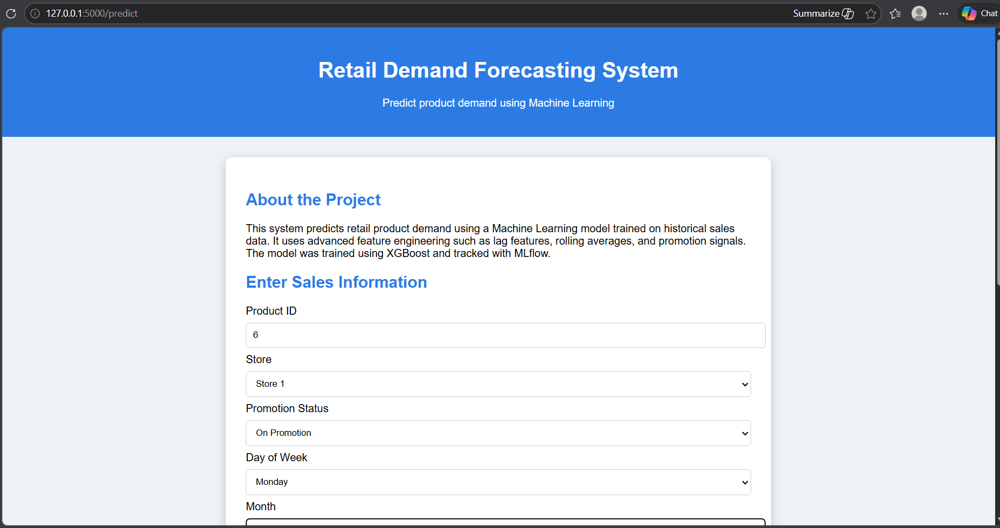
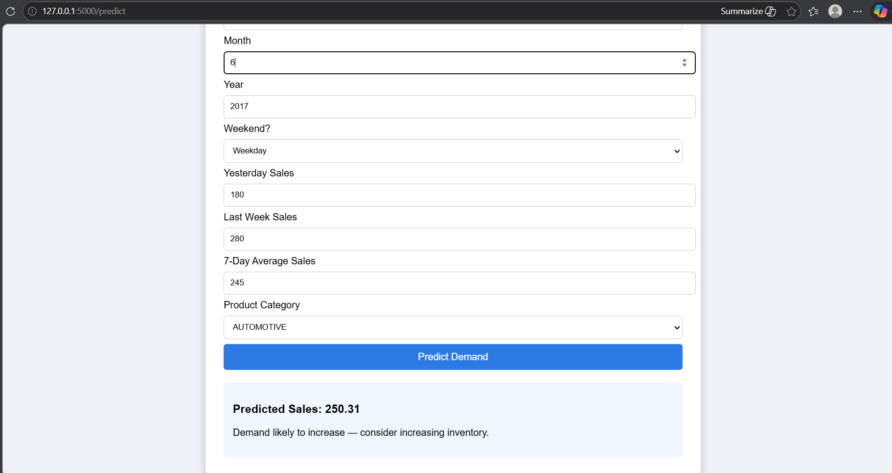
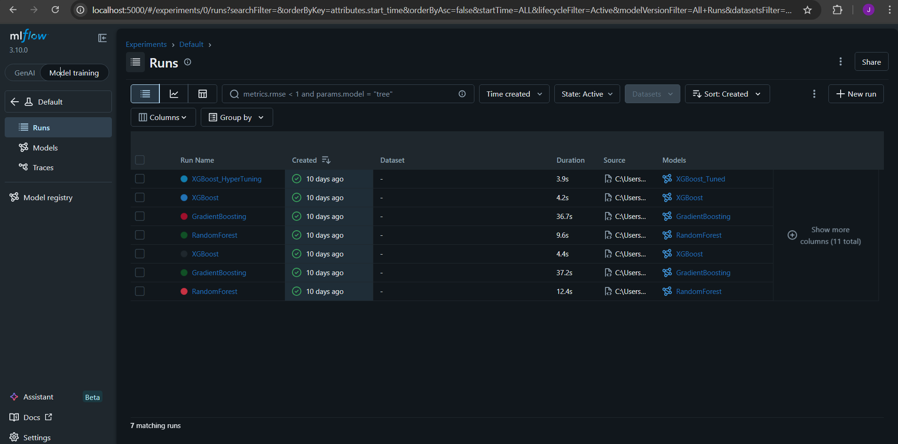
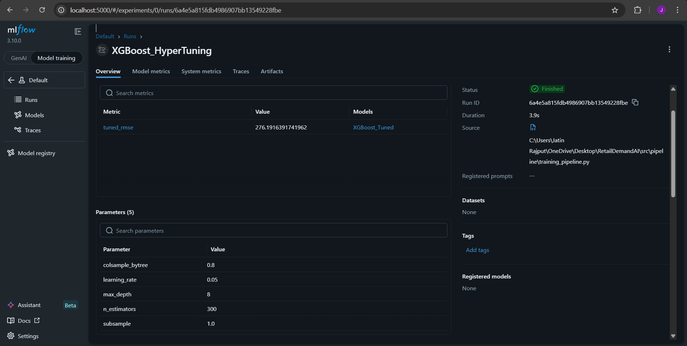
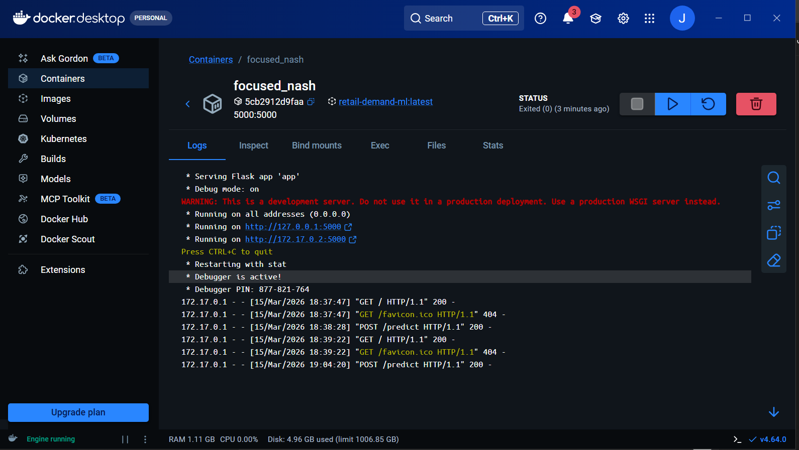

# Retail Demand Forecasting ML System

An **end-to-end machine learning system** designed to forecast retail product demand using historical sales data.
This project demonstrates a **production-style ML pipeline** including data processing, feature engineering, model training, experiment tracking, API deployment, and containerized inference using Docker.

The system helps retailers **anticipate product demand and optimize inventory decisions** using machine learning predictions.

---

# Project Highlights

* Modular **machine learning pipeline architecture**
* Advanced **feature engineering for time-series data**
* Multi-model training and **hyperparameter tuning**
* **MLflow experiment tracking**
* Real-time prediction using **Flask API**
* Interactive **web interface for inference**
* **Docker containerization** for reproducible deployment
* Demonstrates practical **MLOps workflow**

---

# Problem Statement

Retail businesses often struggle to accurately forecast product demand due to changing customer behavior, promotions, and seasonal trends.

This project builds a **machine learning demand forecasting system** that leverages historical sales data to predict future demand and support data-driven inventory planning.

---

# System Architecture

User
↓
Web Interface (HTML/CSS)
↓
Flask API
↓
Prediction Pipeline
↓
Trained ML Model (XGBoost)
↓
Predicted Demand Output

Training Workflow:

Raw Data
↓
Data Ingestion
↓
Data Validation
↓
Feature Engineering
↓
Model Training
↓
Hyperparameter Tuning
↓
Experiment Tracking (MLflow)
↓
Saved Model

---

# Tech Stack

**Programming**

* Python

**Data Processing**

* Pandas
* NumPy

**Machine Learning**

* Scikit-learn
* XGBoost

**Experiment Tracking**

* MLflow

**Deployment**

* Flask
* Docker

**Frontend**

* HTML
* CSS

---

# Project Structure

RetailDemandAI
│
├── app.py
├── Dockerfile
├── requirements.txt
├── README.md
│
├── models
│   └── best_model.pkl
│
├── src
│   ├── components
│   │   ├── data_ingestion.py
│   │   ├── data_validation.py
│   │   ├── feature_engineering.py
│   │   └── model_trainer.py
│   │
│   └── pipeline
│       ├── training_pipeline.py
│       └── prediction_pipeline.py
│
├── templates
│   └── index.html
│
├── mlruns
│
└── notebooks

---

# Machine Learning Pipeline

### Data Ingestion

* Loads retail sales dataset
* Stores processed dataset

### Data Validation

* Detects missing values
* Removes duplicate rows

### Feature Engineering

Creates predictive features such as:

* Day of week
* Month
* Year
* Weekend indicator
* Lag features (previous sales)
* Rolling averages

These features help capture **temporal demand patterns**.

---

# Model Training

Multiple models are trained and evaluated:

* Random Forest
* Gradient Boosting
* XGBoost

The best-performing model is selected based on **RMSE (Root Mean Squared Error)**.

Hyperparameter tuning is used to improve model performance.

---

# Experiment Tracking

MLflow is used to track:

* Model parameters
* Training metrics
* Model artifacts
* Experiment runs

To view experiments:

```
mlflow ui
```

Open in browser:

```
http://localhost:5000
```

---

# Running the Training Pipeline

Run the training workflow:

```
python -m src.pipeline.training_pipeline
```

This will:

1. Load dataset
2. Validate data
3. Perform feature engineering
4. Train multiple models
5. Select the best model
6. Save the trained model

---

# Running the Application

Start the Flask application:

```
python app.py
```

Open in browser:

```
http://localhost:5000
```

Enter input values and generate predictions.

---

# Docker Deployment

The application is containerized using Docker for reproducible environments.

Build Docker image:

```
docker build -t retail-demand-ml .
```

Run container:

```
docker run -p 5000:5000 retail-demand-ml
```

Open in browser:

```
http://localhost:5000
```

---

# Example Prediction Workflow

1. User enters sales features through the web interface
2. Flask API receives input data
3. Prediction pipeline preprocesses the input
4. Trained model generates demand prediction
5. Predicted sales value is displayed in the UI

---

# Dataset

This project uses the **Store Sales Time Series Forecasting dataset**.

Dataset link:

https://www.kaggle.com/competitions/store-sales-time-series-forecasting/data

---

# Future Improvements

Possible extensions include:

* Model monitoring and logging
* Automated retraining pipeline
* Cloud deployment (AWS / GCP / Azure)
* Real-time streaming data integration
* Model explainability using SHAP

---

# Author

**Jatin Kumar Rajput**
B.Tech CSE (Honors) – Artificial Intelligence & Machine Learning
Graphic Era Hill University, Dehradun

---

# Screenshots










